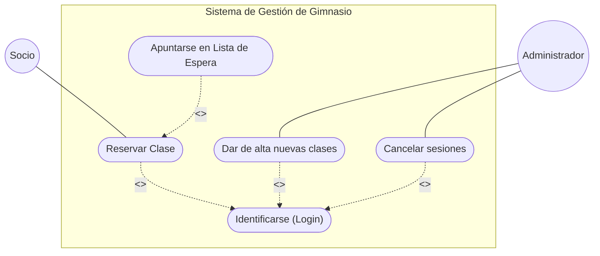

# Gesti-n_del_Sistema_-GymMaster-

El gimnasio "GymMaster" quiere digitalizar un proceso crítico: La gestión de Clases Colectivas con reserva previa. 
Como analista de software, debes entregar la documentación técnica de este módulo utilizando UML.

Ejercicio 1.

